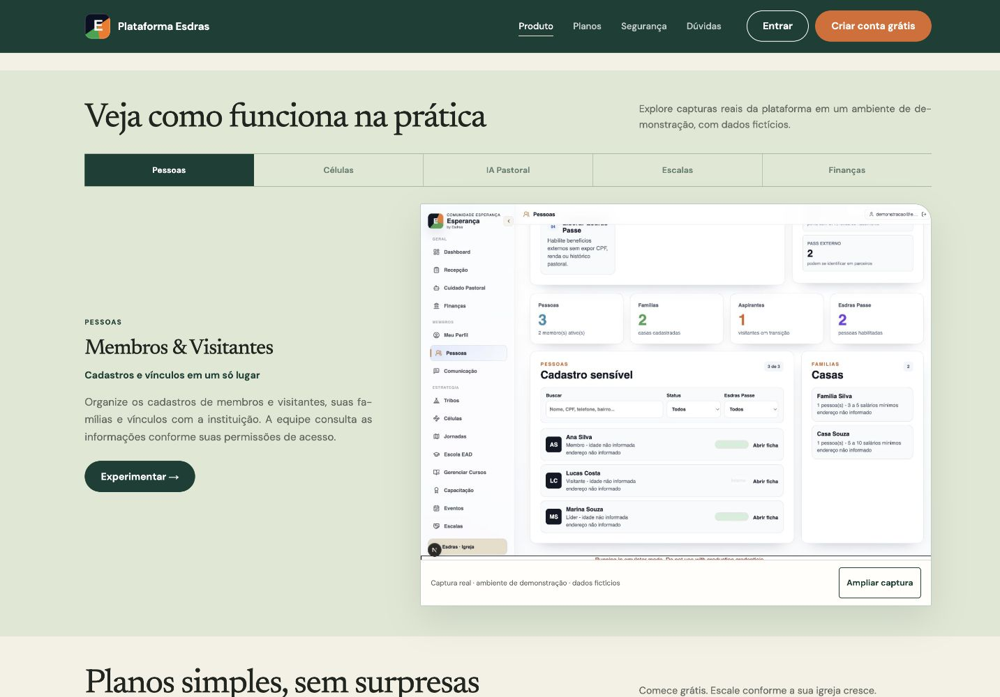
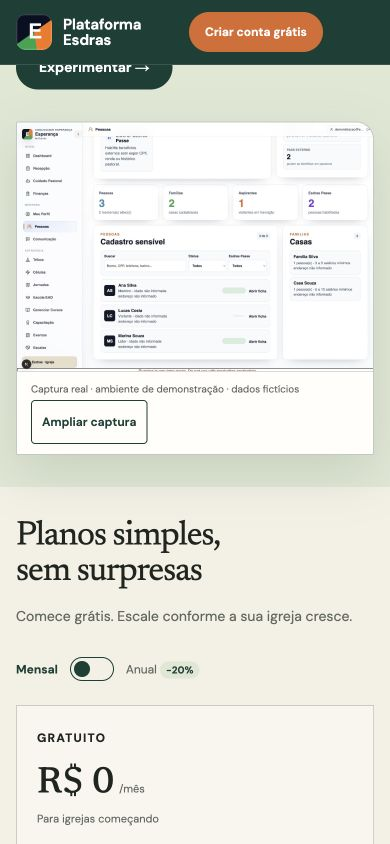

# Entrega 28 — capturas reais e leitura das demonstrações

## Resultado

As cinco imagens editadas generativamente foram substituídas por capturas
intactas da aplicação: Pessoas, Células, Cuidado Pastoral, Escalas e Finanças.
A origem é uma instituição fictícia em `demo-alvo-qa`, exclusivamente nos
emuladores locais. Nenhum dado de cliente ou pagamento real foi utilizado.

Os arquivos WebP usam compressão sem perdas. Os pixels decodificados dos cinco
arquivos foram comparados aos PNGs originais e são idênticos. Dimensões:
1433 × 1000; total de 1.520.590 bytes por aplicação. Aumento de peso em relação
às ilustrações anteriores aceito para preservar a fidelidade; cada aba carrega
sua própria imagem. [Manifesto de integridade](evidencias-lp-2026-09-14/capturas.json).
O aviso do ambiente local permanece visível nas capturas: não foram editadas
para parecerem imagens de produção.

A LP dedicada e `/landing` usam os mesmos ativos e legendas. As dez cópias
anteriores sem referências foram removidas; o histórico permanece no Git.
O script `scripts/seed-lp-captures.ts` permite preparar a instituição fictícia e
recusa execução fora do emulador. Dados adicionais de presença e confirmação
foram registrados pelos controles normais das telas durante a captura.

## Experiência

- Ampliar/fechar captura, Escape e retorno de foco ao botão de origem.
- No celular, imagem ampliada com rolagem interna, posição inicial centralizada
  e instrução de deslize; a página não ganha rolagem horizontal.
- Abas com setas, Home/End e associação ao painel acessível.
- Títulos de módulo até 30 px na LP dedicada; ritmo compacto e textos
  justificados preservados. Âncoras consideram o cabeçalho fixo.
- Textos de Células, IA e Finanças ajustados ao fluxo demonstrado. A imagem de
  Cuidado Pastoral mostra o estado anterior ao primeiro pedido; não representa
  geração de IA homologada nem sugere que houve chamada ao provedor neste QA.

## Verificação

- Build e TypeScript da LP: seis páginas geradas.
- Build OpenNext e TypeScript do painel: 82 páginas/rotas estáticas geradas,
  além das rotas dinâmicas; configuração final conferida com emulador desativado.
- Cinco abas e cinco imagens carregadas no navegador.
- Desktop 1440 px e celular 390 px sem overflow da página.
- Diálogo móvel: largura de 374 px, imagem de 1000 px com rolagem interna;
  Escape fecha e devolve foco a “Ampliar captura”.
- FAQ confirma 50 membros; destinos de cadastro, login e políticas preservados.
- Na navegação por Produto, o título permanece abaixo do cabeçalho fixo.
- `git diff --check` sem erros. Não foram criados testes que apenas repetem
  o código visual nem recontados testes antigos como executados nesta entrega.

## Progresso e limites

LP **99 → 100%** do escopo atual: concluída a pendência de capturas reais,
com revisão visual e funcional. Global **96,35 → 96,40%**:
`96,35 + (5 × 1) / 100 = 96,40`.
Gratuito permanece com **50 membros**. Não é uma medição de conversão nem
certificação de todos os módulos da plataforma. Passe em estabelecimento,
Kids/app em aparelhos, comunicação por provedor e homologação de IA permanecem
no backlog. Refinamentos de preferência visual podem continuar após esta entrega.

## Publicação

- LP: `a1ab6cda-048c-4865-aba5-00b96d629efc`.
- Painel: `509fa4c5-ebe7-4d89-acc6-5887866a86ad`.
- Domínio oficial, `/landing` e `/login`: HTTP 200. API de faturamento sem
  autenticação: HTTP 401, conforme esperado.
- Dez verificações de ativos remotos: as cinco imagens nas duas aplicações
  retornaram 200 e bytes idênticos aos arquivos locais.
- Navegador confirmou a captura nova no domínio oficial. Os nomes dos segredos
  remotos Asaas, IA e Turnstile permanecem configurados; seus valores não foram
  lidos. O aviso do deploy referia-se à ausência do segredo no ambiente local.
- O servidor demonstrativo foi encerrado e o painel local foi restaurado com
  a compilação normal. Os emuladores preexistentes permaneceram disponíveis.
